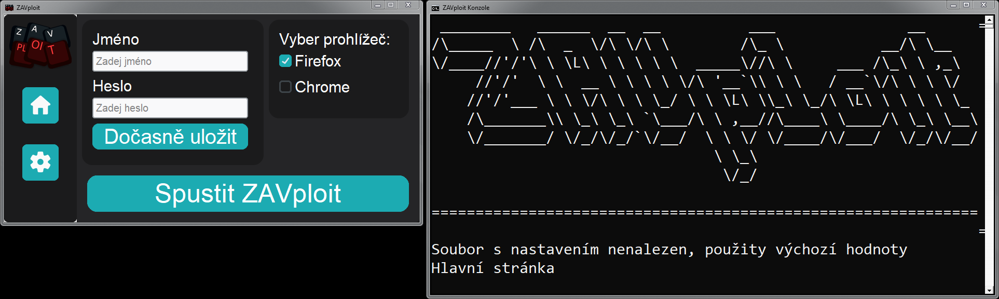

# ZAVploit

> **VAROVÁNÍ:** Autor nenese žádnou zodpovědnost za jakékoliv použití tohoto programu. Používání této aplikace může být v rozporu s podmínkami služby [student.zav.cz](https://student.zav.cz/#!/login) nebo jinými právními předpisy. **Projekt je určen pouze pro vzdělávací účely. Používejte na vlastní nebezpečí! Silně nedoporučováno používat ve škole.**
<br> Neboli - pokud vás někdo chytne, že tento program používáte, je to vaše chyba a ne autora tohoto programu.


ZAVploit je desktopová aplikace napsaná v pythonu, která slouží jako exploit [ZAVu](https://student.zav.cz/#!/login). Hlavním cílem je zpřístupnění backspacu v jakémkoliv cvičení, bez mučení mozku, když uděláte chybu. 

## Funkce

- **Automatizované přihlášení** – Program podporuje uložení uživatelských údajů ze ZAVu. Pozor! Uživatelské údaje se ukládají do lokálního nešifrovaného souboru `nastaveni.json`!
- **Spuštění prohlížeče s exploitací** – Otevře vybraný prohlížeč (Firefox/Chromium), který hned zapne stránku ZAV, kde vás následně automaticky přihlásí a aplikuje exploit.
- **Notifikace** – Po úspěšném spuštění exploitu program informuje uživatele notifikací.
- **GUI v customtkinter** – Moderní rozhraní pro ovládání aplikace, nastavení témat a přihlášení.
- **Výběr motivů** – Na výběr je až z 10ti motivů
- **Možnost opakované aktivace exploitu** – V nastavení je možnost znovu aktivovat exploit

## Instalace

1. **Klonování repozitáře**
   ```bash
   git clone https://github.com/rodrickhmmm/ZAVploit.git
   cd ZAVploit
   ```

2. **Instalace závislostí**
   - na instalaci všech potřebných věcí spusťte **install.bat**. Tento soubor nainstaluje všechny potřebné knihony a samotný Python.

3. **Spuštění aplikace**
   - Windows: Spusťte soubor `ZAVploit.bat`
   - Nebo přímo pomocí příkazového řádku:
     ```bash
     python main.py
     ```

## Použití
  
- poté, co spustíte `ZAVploit.bat`, se vám zobrazí GUI a ZAVploit "konzole"
- ZAVploit "konzole" si nemusíte všímat a můžete si to skrýt (bacha, nezavírat - to zavře celý program!), funguje jako menší debug (nebo pokud se chcete cítit jako "hacker", tak si to můžete nechat otevřené)
- V GUI lze přepínat mezi hlavní stránkou a nastavením.
- Na hlavní stránce najdete:
  - zadání uživatelských údajů
  - vybrání prohlížeče
  - spuštění samotného exploitu.

- V nastavení:
  - výběr motivů
  - zapnutí/vypnutí automatického přihlášení
  - nastavení exploitu:
    - zaktivovat znovu exploit
    - přihlásit znovu
    - vypnout prohlížeč.


## Poznámky

- Projekt je ve stádiu "Beta", může obsahovat chyby.

## Licence

Tento projekt je určen pouze pro vzdělávací účely. Používejte zodpovědně!

---

**Pokud narazíte na chybu nebo máte nápad na vylepšení, neváhejte otevřít [issues stránku](https://github.com/rodrickhmmm/ZAVploit/issues)!**
